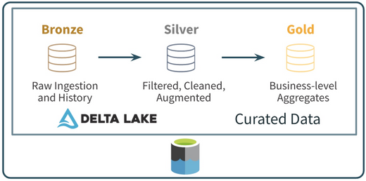
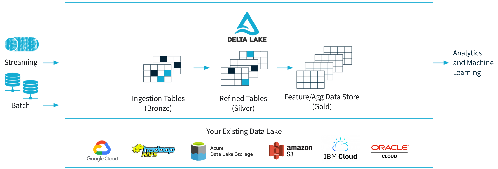

[\[Return to blog\]](index.md) [\[Home\]](../index.md)

## Brainfood Blog: Delta Lake

Delta Lake es un framework de almacenamiento desarrollado en el lenguaje
de programación Scala. Es una herramienta de código abierto para la
arquitectura Lakehouse. Popular por sus integraciones con Spark, Flink,
PrestoDB, Hive, entre otros, así como por su capacidad para poder realizar
transacciones ACID. Ofrece un manejo escalable de metadata, versionado de
snapshots, variaciones de esquema, entre otros, convirtiéndola en una
herramienta robuesta para la construcción de Data Lakehouses.

### Arquitectura Lakehouse

#### Data Warehouse

En primer lugar, tenemos una arquitectura Data Warehouse, pensada para soportar
bloques de data estructurada y en dar soporte a las areas de reporteria y BI,
centrándose en la generación de valor para los tomadores de decisiones.
Esta arquitectura tiene un costo elevado para manejar data no estructurada o
semi-estructurada, así como dificultades para incrementar en volumen y usuarios
concurrentes.

#### Data Lake

En segundo lugar, consideremos una arquitectura Data Lake. Este sistema tiene
como base el almacenamiento de data cruda (Estructurada, semi y no estructurada)
y se centra en la disponibilización de la información para las áreas de
Data Science y Machine Learning. Si bien cubre deficiencias de un Data Warehouse,
no refuerzan la calidad de la data, consistencia, aislamiento y presenta
dificultades para realizar mezclas de jobs en batch y streaming.

#### Arquitectura Lakehouse

Una alternativa para cubrir los gaps de las dos previas arquitecturas mencionadas
es implementar ambos sistemas, con la finalidad de habilitar tanto al equipo
de reporteria y BI como a los data scientists y machine learning engineers.
Esta alternativa resulta en duplicidad de información y costos elevados de
infraestructura. En este contexto, se presenta la arquitectura Lakehouse, como
una alternativa que combina la flexibilidad y escalabilidad de los data lakes con
la transaccionabilidad de los data warehouses.

    

La arquitectura lakehouse implementa las funcionalidades de estructuración de
datos y de gestión de la información sobre la capa de bajo costo empleada en 
data lakes. Los diferentes equipos de data science, machine learning, BI y
reportería tendrán acceso directo a la versión mas reciente de la información,
como se muestra en la imagen.

Las funcionalidades clave que conforman la arquitectura lakehouse son:

-  Capas de metadata: Mediante el uso de archivos Parquet se almacena la metadata
que guarda el versionado de la información y ofrece transacciones ACID

-  Optimización de queries: Mediante el cacheo de data en RAM/SSDs y ejecuciones
vectoriales en CPUs modernos.

-  Acceso optimizado a herramientas de Data Science y Machine Learning: El uso
del formato Parquet y compatibilidad con herramientas populares como Pandas, 
TensorFlow, PyTorch, entre otros.

### Delta Lake y Transacciones ACID

La arquitectura lakehouse previamente revisada se construye sobre Delta Lake,
un framework o herramienta de trabajo construida sobre Apache Spark. Delta Lake
emplea archivos Parquet para almacenar la data, as como logs de las transacciones
y commits realizados a la misma.

    

El Delta Lake tiene 3 ambientes de manejo de data:

Bronze: Espacio de almacenamiento raw de la información. Se ingesta la data
sin modificaciones o refinamiento y se convierte los formatos a Delta Lake.

Silver: En este ambiente se realizan transformaciones, refinamiento y feature
engineering. La data de este bloque puede ser tomada o consultada por los equipos
de BI o Data Science

Gold: La etapa más refinada de la información. Se emplea principalmente para
la generación de vistas finales de los datos, actualización de dashboards o 
entrega de valor a los equipos tomadores de decisiones.

## Delta Lake in cloud - Hands On

Empleando las plataformas cloud más populares (AWS, Azure, GCP), el proceso
de implementación de un Delta Lake sigue los siguientes pasos:

- Configuración de Apache Spark: Delta Lake interactua con Spark Scala o PySpark.
Dependiendo del ambiente en uso se puede optar por Python o Scala.

- Ingesta de la información: Desde un Data Lake existente o creando los ambiente
Delta Lake (Bronze, Silver Gold) empleando S3 Buckets (AWS), Blob Storage (Azure)
o Cloud Storage (GCP). La información puede ingestarse al Delta Lake en Batch
o Streaming.

- Creación y actualización de la información: Para crear tablas Delta, podemos
emplear Spark SQL y manipular información de parquet, csv, json a delta. El
framework posibilita creación, lectura, actualización, versionado de tablas
anteriores, streaming y batch.

    

## Recomendaciones

En que casos usar lakehouse. Delta lake sobre arquitectura comun. 

