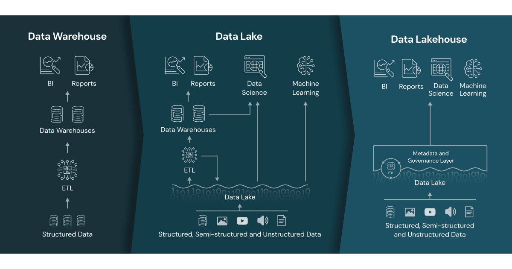

[\[Return to blog\]](index.md) [\[Home\]](../index.md)

## Brainfood Blog: Delta Lake

Delta Lake es un framework de almacenamiento desarrollado en el lenguaje
de programación Scala. Es una herramienta de código abierto para la
arquitectura Lakehouse. Popular por sus integraciones con Spark, Flink,
PrestoDB, Hive, entre otros, así como por su capacidad para poder realizar
transacciones ACID. Ofrece un manejo escalable de metadata, versionado de
snapshots, variaciones de esquema, entre otros, convirtiéndola en una
herramienta robuesta para la construcción de Data Lakehouses.

## Arquitectura Lakehouse

    

## Transacciones ACID

## Delta Lake in cloud - Hands On

## Recomendaciones

